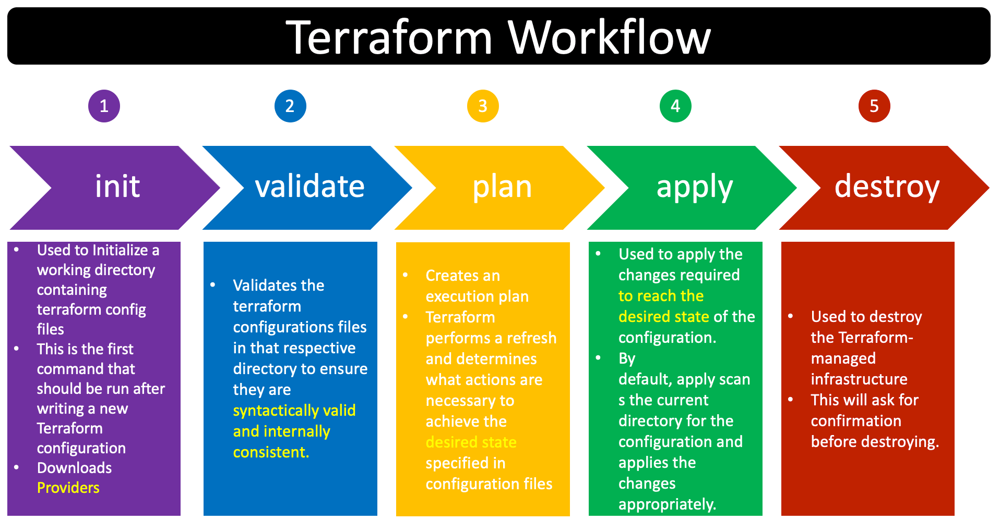
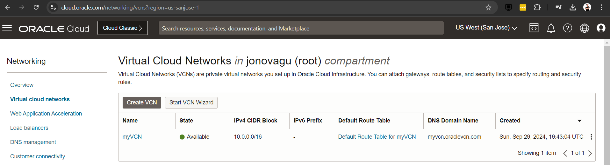
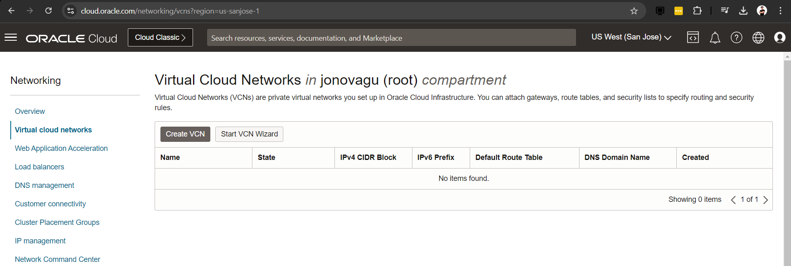

# TERRAFORM AT OCI

## What Is Terraform

Terraform is an open-source tool used to define and manage **Infrastructure As Code**.

It lets you describe the resources you need—like servers, databases, and networking—using a **simple configuration language**.

> To remember: IaC is the practice of managing and provisioning computing infrastructure through machine-readable configuration files, rather than manually configuring hardware or interactive tools

## Hashicorp

HashiCorp is the company that created Terraform. Besides Terraform, HashiCorp offers a range of other tools that help with different aspects of managing cloud infrastructure, such as:

- **Vault**: For managing secrets and encryption keys.
- **Consul**: For service discovery and configuration.
- **Nomad**: For workload orchestration (running applications on clusters).
- **Vagrant**: For creating reproducible development environments.

https://www.hashicorp.com/

## HCL

HCL (HashiCorp Configuration Language) is the language used to write configuration files for Terraform and other HashiCorp tools.

Example of HCL code in Terraform:

```hcl
provider "oci" {
  tenancy_ocid = var.tenancy_ocid
  user_ocid = var.user_ocid
  fingerprint = var.fingerprint
  private_key_path = var.private_key_path
  region = var.region
}

data "oci_identity_availability_domains" "ads" {
  compartment_id = var.tenancy_ocid
}

output "show-ads" {
  value = data.oci_identity_availability_domains.ads.availability_domains
}

```

*You don't need to understand this code right now.*

## Terraform Commands

`terraform -help`

Shows the help menu:
```hcl
$ terraform -help
Usage: terraform [global options] <subcommand> [args]

The available commands for execution are listed below.
The primary workflow commands are given first, followed by
less common or more advanced commands.

Main commands:
  init          Prepare your working directory for other commands
  validate      Check whether the configuration is valid
  plan          Show changes required by the current configuration
  apply         Create or update infrastructure
  destroy       Destroy previously-created infrastructure

All other commands:
  console       Try Terraform expressions at an interactive command prompt
  fmt           Reformat your configuration in the standard style
  force-unlock  Release a stuck lock on the current workspace
  get           Install or upgrade remote Terraform modules
  graph         Generate a Graphviz graph of the steps in an operation
  import        Associate existing infrastructure with a Terraform resource
  login         Obtain and save credentials for a remote host
  logout        Remove locally-stored credentials for a remote host
  metadata      Metadata related commands
  output        Show output values from your root module
  providers     Show the providers required for this configuration
  refresh       Update the state to match remote systems
  show          Show the current state or a saved plan
  state         Advanced state management
  taint         Mark a resource instance as not fully functional
  test          Experimental support for module integration testing
  untaint       Remove the 'tainted' state from a resource instance
  version       Show the current Terraform version
  workspace     Workspace management

Global options (use these before the subcommand, if any):
  -chdir=DIR    Switch to a different working directory before executing the
                given subcommand.
  -help         Show this help output, or the help for a specified subcommand.
  -version      An alias for the "version" subcommand.
```

`terraform version`

```
yourtenancyname@cloudshell:~ $ terraform version
Terraform v1.5.7
on linux_arm64

Your version of Terraform is out of date! The latest version
is 1.9.5. You can update by downloading from https://www.terraform.io/downloads.html
```
`terraform init`

This command prepares the working directory for other commands. It initializes the backend configuration and downloads the required provider in modules. 

`terraform validate`

Check if the configuration is syntactically valid.

`terraform plan`

It generates an execution plan without executing it, it let's you review the changes that will be applied.

`terraform apply`

It executes the terraform plan.

`terraform destroy`

Destroy previously-created infrastructure

``terraform output`

Display the output values defined in your root module.

`terraform fmt`

Reformat your configuration in the standard terraform style. Using a standard style makes collaboration easier.

## Cloud Shell

You can use the Oracle Cloud Shell to follow this tutorial:


## Update Terraform

IMPORTANT. YOU MAY **NOT** HAVE ENOUGH PERMISSIONS IN CLOUD SHELL TO UPDATE TERRAFORM; THEREFORE THESE INSTRUCTIONS ARE VALID IF YOU ARE IN YOUR OWN SYSTEM.

Chek If your terraform version is out of date:

```HCL
yourtenancyname@cloudshell:~ $ terraform version
Terraform v1.5.7
on linux_arm64

Your version of Terraform is out of date! The latest version
is 1.9.5. You can update by downloading from https://www.terraform.io/downloads.html
```

1. Download the latest version (1.9.5 in this example):

```
yourtenancyname@cloudshell:~ $ wget https://releases.hashicorp.com/terraform/1.9.5/terraform_1.9.5_linux_amd64.zip
--2024-09-29 17:54:38--  https://releases.hashicorp.com/terraform/1.9.5/terraform_1.9.5_linux_amd64.zip
Resolving releases.hashicorp.com (releases.hashicorp.com)... 3.168.86.117, 3.168.86.69, 3.168.86.38, ...
Connecting to releases.hashicorp.com (releases.hashicorp.com)|3.168.86.117|:443... connected.
HTTP request sent, awaiting response... 200 OK
Length: 27040662 (26M) [application/zip]
Saving to: ‘terraform_1.9.5_linux_amd64.zip’

100%[===============================================================================================================================================================================================>] 27,040,662  --.-K/s   in 0.09s   

2024-09-29 17:54:38 (293 MB/s) - ‘terraform_1.9.5_linux_amd64.zip’ saved [27040662/27040662]

yourtenancyname@cloudshell:~ $ l
total 26M
-rw-r--r--. 1 yourtenancyname oci 1.7K Aug  3 01:58 stack.zip
-rw-r--r--. 1 yourtenancyname oci    1 Aug  1 22:57 suggestion_variable.txt
-rw-r--r--. 1 yourtenancyname oci  26M Aug 20 18:06 terraform_1.9.5_linux_amd64.zip
yourtenancyname@cloudshell:~ $ 
```

2. Unzip the file

```
yourtenancyname@cloudshell:~ $ unzip terraform_1.9.5_linux_amd64.zip
Archive:  terraform_1.9.5_linux_amd64.zip
  inflating: LICENSE.txt             
  inflating: terraform
           
yourtenancyname@cloudshell:~ $ l
total 111M
-rw-r--r--. 1 yourtenancyname oci 4.9K Aug 20 17:24 LICENSE.txt
-rw-r--r--. 1 yourtenancyname oci 1.7K Aug  3 01:58 stack.zip
-rw-r--r--. 1 yourtenancyname oci    1 Aug  1 22:57 suggestion_variable.txt
-rwxr-xr-x. 1 yourtenancyname oci  85M Aug 20 17:24 terraform*
-rw-r--r--. 1 yourtenancyname oci  26M Aug 20 18:06 terraform_1.9.5_linux_amd64.zip
yourtenancyname@cloudshell:~ $ 
```

3. Replace the old version for the newest version:

```
yourtenancyname@cloudshell:~ $ which terraform
/usr/bin/terraform

yourtenancyname@cloudshell:~ $ #let's check it is not a soft link
yourtenancyname@cloudshell:~ $ l /usr/bin/terraform
-rwxr-xr-x. 1 root root 67M Sep  7  2023 /usr/bin/terraform*

yourtenancyname@cloudshell:~ $ mv terraform /usr/bin/terraform
mv: try to overwrite ‘/usr/bin/terraform’, overriding mode 0755 (rwxr-xr-x)? 
yourtenancyname@cloudshell:~ $ 
```

4. Check the new version:

```
terraform version
```

## Variables

> NOTE: You may want to just read the following sections until you reach the Example section where you can have some practice, for now the following sections are just for explanation.

Variables are used to hold values that can be reused among configuration files, it helps to make a change in one place instead of doing it in all places where we have the value, it is also useful to avoid mistakes by using different values instead of using the same.

> **Important to know before continuing**: In Terraform, the most commonly used naming convention for variables is `snake_case`, where words are separated by underscores (_) instead of blank spaces. This convention is widely adopted to improve readability and consistency. Example `compartment_id` instead of `compartment id`, you can also use `camelCase` (example `compartmentId`) or any other convention as long as you do NOT use blank spaces.

How to use variables in Terraform:

- Create a `variables.tf file`: this file contain the definition of the variables, e.g. the type (string, number, etc.), default value, description, validations like a number less than certain amount.

- Create a `terraform.tfvars` file: this file contains the values of the variables

- Use the variables by using the syntax `var.<name of the variable>`, replace the name of the variable in the angle brackets (then remove the angle brackets), example `var.compartment_id`.

### Environmental Variables

You can use environment variables in Terraform to manage configuration values

Suppose you have the following variable defined in variables.tf:

```HCL
variable "instance_count" {
  description = "The number of instances to create"
  type        = number
  default     = 1
}
```

You can set the environment variable as follows:

```HCL
export TF_VAR_instance_count=3
```

Terraform checks for environment variables that start with TF_VAR_ and automatically assigns their values to the corresponding input variables in your Terraform configuration.

## Providers

In Terraform, a provider is a **plugin** that defines the resources and services you can interact with in your infrastructure.

It acts as a **bridge between Terraform and the APIs of the services** you want to provision or manage, such as cloud platforms (OCI, AWS, Azure, GCP), infrastructure components (Kubernetes, Docker), or even SaaS products (GitHub, Datadog).

There are three types of providers:

- **Cloud providers**: used for IaC in cloud.
- **On-premises providers**: it allows you to manage infrastructure on premises, some common on-premises providers are VMware and OpenStack, Docker.
- **Specialized providers**: Terraform has specialized providers for DNS databases like MySQL and PostgreSQL, content delivery networks, CDNs, monitoring tools like Prometheus, etc.

This tutorial focus on CLoud providers using OCI.

### How Configure Providers In Terraform

```HCL
terraform {
    required_providers {
        oci = {
            source  = "oracle/oci"
            version = "4.10.0"
        }
    }
}

provider {
    tenancy_ocid     = "value here"
    user_ocid        = "value here"
    fingerprint      = "value here"
    private_key_path = "value here"
    region           = "value here"
}
```

## Resources

Resources in Terraform are the building blocks of your infrastructure. They represent the components or services you want to create, manage, or configure in your cloud or on-prem environment.

Examples are:

- A VCN
- A compute instance
- A database
- A storage bucket
- Etc.

## Outputs

Outputs are used to display information of deployed resources.

Outputs are defined in the configuration files.

Example:

```HCL
resource "oci_core_subnet" "example_subnet" {
    cidr_block     = var.subnet_cidr_block
    compartment_id = var.compartment_id
    vcn_id         = oci_core_vcn.test_vcn_id
}
output "subnet_id" {
    value = oci_core_subnet.example_subnet.id
}


resource "oci_core_instance" {
    availability_domain = "your_availability_domain"
    compartment_id      = "your_compartment_id"
    shape               = "VM.Standard2.1"
    display_name        = "ExampleInstance"
    image_id            = "your_image_id"
    # Using output:
    subnet_id           = oci_core_subnet.example_subnet.id
}
```

## Modules

Modules in Terraform are reusable, self-contained packages of Terraform configuration files that define a set of resources. They help you organize and manage your infrastructure as code more effectively.

For instance, if you frequently create compute instances, you can create a module that includes all the configurations for a compute instance. Then, whenever you need an instance, you just call that module instead of rewriting the configurations.

## State

The `terraform.tfstate` file is a critical component of Terraform's infrastructure as code (IaC) workflow:

- **State Management**: The terraform.tfstate file keeps track of the current state of your infrastructure. It records the resources that Terraform manages, including their properties, dependencies, and relationships.

- **Mapping**: When you apply a Terraform configuration, Terraform creates or modifies resources in your cloud provider (like AWS, Azure, etc.). The state file maps the resources defined in your .tf files to those that actually exist in the cloud.

- **Data Storage**: The state file is stored in **JSON** format and includes information about resource attributes, IDs, and metadata. This allows Terraform to understand what resources have been created and how to manage them.

- **Dependency Resolution**: By keeping track of resource dependencies, the state file helps Terraform determine the correct order to create, update, or delete resources. This is essential for maintaining infrastructure consistency.

- **Collaboration**: When multiple people work on the same Terraform project, it’s important to manage the state file carefully. Using remote state storage (like AWS S3, Terraform Cloud, or Azure Blob Storage) can help coordinate changes and prevent conflicts.

- **Drift Detection**: The state file helps detect any "drift" between the actual state of the infrastructure and the desired state defined in your configuration files. If changes are made directly to resources outside of Terraform, the next terraform plan will show those discrepancies.


### Important Notes:

- **Do Not Edit Manually**: You should not edit the terraform.tfstate file manually, as it can lead to inconsistencies and errors in your infrastructure management.

- **Backups**: It's a good practice to keep backups of your state file, especially before making significant changes to your infrastructure.

- **Sensitive Data**: The state file may contain sensitive information (like passwords or access keys). Be cautious about how you handle and store this file.

## Terraform Workflow



## Example

Time for practice!

1. Create a directory where you will store all your configuration files:

```
yourtenancyname@cloudshell:~ $ cd ~
yourtenancyname@cloudshell:~ $ mkdir iac
yourtenancyname@cloudshell:~ $ cd iac
yourtenancyname@cloudshell:~/iac $ 
```

2. Now create a `main.tf` file, this is the root configuration file

```
yourtenancyname@cloudshell:~/iac $ touch main.tf
```

Add the following code to the file:

```HCL
terraform {
    required_providers {
        oci = {
            source = "oracle/oci"
        }
    }
}

provider "oci" {
    # tenancy_ocid = "value here"
    # user_ocid = "value here"
    # private_key_path = "value here"
    # fingerprint = "value here"
    region = "value here"
}

resource "oci_core_virtual_network" "myVCN" {
    compartment_id = "value here"
    cidr_block = "10.0.0.0/16"
    dns_label = "myVCN"
    display_name = "myVCN"
}
```

> Since we are in the cloud shell we do not need to provide the lines that are commented, only update the region and compartment_id.

You can get the region using this command `echo $OCI_REGION` (or take a look at the URL and see if you see a query parameter for the region).

3. Initialize the environment:

```
yourtenancyname@cloudshell:~/iac $ terraform init

Initializing the backend...

Initializing provider plugins...
- Finding latest version of oracle/oci...
- Installing oracle/oci v6.11.0...
- Installed oracle/oci v6.11.0 (signed by a HashiCorp partner, key ID 6C63B40Q73117CEW)

Partner and community providers are signed by their developers.
If you'd like to know more about provider signing, you can read about it here:
https://www.terraform.io/docs/cli/plugins/signing.html

Terraform has created a lock file .terraform.lock.hcl to record the provider
selections it made above. Include this file in your version control repository
so that Terraform can guarantee to make the same selections by default when
you run "terraform init" in the future.

Terraform has been successfully initialized!

You may now begin working with Terraform. Try running "terraform plan" to see
any changes that are required for your infrastructure. All Terraform commands
should now work.

If you ever set or change modules or backend configuration for Terraform,
rerun this command to reinitialize your working directory. If you forget, other
commands will detect it and remind you to do so if necessary.
yourtenancyname@cloudshell:~/iac $ 
```

Note that a `.terraform` directory was created:

```
yourtenancyname@cloudshell:~/iac $ l -a
total 12K
drwxr-xr-x.  3 yourtenancyname oci   66 Sep 29 19:35 ./
drwxr-xr-x. 10 yourtenancyname oci 4.0K Sep 29 19:17 ../
-rw-r--r--.  1 yourtenancyname oci  522 Sep 29 19:34 main.tf
drwxr-xr-x.  3 yourtenancyname oci   23 Sep 29 19:35 .terraform/
-rw-r--r--.  1 yourtenancyname oci 1.4K Sep 29 19:35 .terraform.lock.hcl
yourtenancyname@cloudshell:~/iac $ find .terraform
.terraform
.terraform/providers
.terraform/providers/registry.terraform.io
.terraform/providers/registry.terraform.io/oracle
.terraform/providers/registry.terraform.io/oracle/oci
.terraform/providers/registry.terraform.io/oracle/oci/6.11.0
.terraform/providers/registry.terraform.io/oracle/oci/6.11.0/linux_arm64
.terraform/providers/registry.terraform.io/oracle/oci/6.11.0/linux_arm64/terraform-provider-oci_v6.11.0
yourtenancyname@cloudshell:~/iac $ 
```

4. Plan

```
yourtenancyname@cloudshell:~/iac $ terraform plan

Terraform used the selected providers to generate the following execution plan. Resource actions are indicated with the following symbols:
  + create

Terraform will perform the following actions:

  # oci_core_virtual_network.myVCN will be created
  + resource "oci_core_virtual_network" "myVCN" {
      + byoipv6cidr_blocks               = (known after apply)
      + cidr_block                       = "10.0.0.0/16"
      + cidr_blocks                      = (known after apply)
      + compartment_id                   = "ocid1.tenancy.oc1..blablabla"
      + default_dhcp_options_id          = (known after apply)
      + default_route_table_id           = (known after apply)
      + default_security_list_id         = (known after apply)
      + defined_tags                     = (known after apply)
      + display_name                     = "myVCN"
      + dns_label                        = "myVCN"
      + freeform_tags                    = (known after apply)
      + id                               = (known after apply)
      + ipv6cidr_blocks                  = (known after apply)
      + ipv6private_cidr_blocks          = (known after apply)
      + is_ipv6enabled                   = (known after apply)
      + is_oracle_gua_allocation_enabled = (known after apply)
      + state                            = (known after apply)
      + time_created                     = (known after apply)
      + vcn_domain_name                  = (known after apply)
    }

Plan: 1 to add, 0 to change, 0 to destroy.

────────────────────────────────────────────────────────────────────────────────────────────────────────────────────────────────────────────────────────────────────────────────────────────────────────────────────────────────────────

Note: You didn't use the -out option to save this plan, so Terraform can't guarantee to take exactly these actions if you run "terraform apply" now.
yourtenancyname@cloudshell:~/iac $ 
```

5. Apply

```
yourtenancyname@cloudshell:~/iac $ terraform apply

Terraform used the selected providers to generate the following execution plan. Resource actions are indicated with the following symbols:
  + create

Terraform will perform the following actions:

  # oci_core_virtual_network.myVCN will be created
  + resource "oci_core_virtual_network" "myVCN" {
      + byoipv6cidr_blocks               = (known after apply)
      + cidr_block                       = "10.0.0.0/16"
      + cidr_blocks                      = (known after apply)
      + compartment_id                   = "ocid1.tenancy.oc1..blablabla"
      + default_dhcp_options_id          = (known after apply)
      + default_route_table_id           = (known after apply)
      + default_security_list_id         = (known after apply)
      + defined_tags                     = (known after apply)
      + display_name                     = "myVCN"
      + dns_label                        = "myVCN"
      + freeform_tags                    = (known after apply)
      + id                               = (known after apply)
      + ipv6cidr_blocks                  = (known after apply)
      + ipv6private_cidr_blocks          = (known after apply)
      + is_ipv6enabled                   = (known after apply)
      + is_oracle_gua_allocation_enabled = (known after apply)
      + state                            = (known after apply)
      + time_created                     = (known after apply)
      + vcn_domain_name                  = (known after apply)
    }

Plan: 1 to add, 0 to change, 0 to destroy.

Do you want to perform these actions?
  Terraform will perform the actions described above.
  Only 'yes' will be accepted to approve.

  Enter a value: yes   <---- NOTE A PROMPT WILL BE DISPLAYED!!!

oci_core_virtual_network.myVCN: Creating...
oci_core_virtual_network.myVCN: Creation complete after 1s [id=ocid1.vcn.oc1.us-sanjose-1.blablabla]

Apply complete! Resources: 1 added, 0 changed, 0 destroyed.
yourtenancyname@cloudshell:~/iac $ 
```

You can confirm this in the UI:



6. Destroy

```
yourtenancyname@cloudshell:~/iac $ terraform destroy
oci_core_virtual_network.myVCN: Refreshing state... [id=ocid1.vcn.oc1.us-sanjose-1.blablabla]

Terraform used the selected providers to generate the following execution plan. Resource actions are indicated with the following symbols:
  - destroy

Terraform will perform the following actions:

  # oci_core_virtual_network.myVCN will be destroyed
  - resource "oci_core_virtual_network" "myVCN" {
      - byoipv6cidr_blocks       = [] -> null
      - cidr_block               = "10.0.0.0/16" -> null
      - cidr_blocks              = [
          - "10.0.0.0/16",
        ] -> null
      - compartment_id           = "ocid1.tenancy.oc1..blablabla" -> null
      - default_dhcp_options_id  = "ocid1.dhcpoptions.oc1.us-sanjose-1.blablabla" -> null
      - default_route_table_id   = "ocid1.routetable.oc1.us-sanjose-1.blablabla" -> null
      - default_security_list_id = "ocid1.securitylist.oc1.us-sanjose-1.blablabla" -> null
      - defined_tags             = {
          - "Oracle-Tags.CreatedBy" = "default/yourtenancyname@gmail.com"
          - "Oracle-Tags.CreatedOn" = "2024-09-29T19:43:04.686Z"
        } -> null
      - display_name             = "myVCN" -> null
      - dns_label                = "myvcn" -> null
      - freeform_tags            = {} -> null
      - id                       = "ocid1.vcn.oc1.us-sanjose-1.blablabla" -> null
      - ipv6cidr_blocks          = [] -> null
      - ipv6private_cidr_blocks  = [] -> null
      - is_ipv6enabled           = false -> null
      - state                    = "AVAILABLE" -> null
      - time_created             = "2024-09-29 19:43:04.785 +0000 UTC" -> null
      - vcn_domain_name          = "myvcn.oraclevcn.com" -> null
    }

Plan: 0 to add, 0 to change, 1 to destroy.

Do you really want to destroy all resources?
  Terraform will destroy all your managed infrastructure, as shown above.
  There is no undo. Only 'yes' will be accepted to confirm.

  Enter a value: yes

oci_core_virtual_network.myVCN: Destroying... [id=ocid1.vcn.oc1.us-sanjose-1.blablabla]
oci_core_virtual_network.myVCN: Destruction complete after 1s

Destroy complete! Resources: 1 destroyed.
yourtenancyname@cloudshell:~/iac $ 
```

And again check the UI to confirm the VCN is gone:



## Example 2

In this example we are going to split the configuration into multiple files.

1. Create the files:

```HCL
yourtenancyname@cloudshell:~ $ cd ~
yourtenancyname@cloudshell:~ $ mkdir example2
yourtenancyname@cloudshell:~ $ cd example2/
yourtenancyname@cloudshell:~/example2 $ touch main.tf variables.tf terraform.tfvars providers.tf

yourtenancyname@cloudshell:~/example2 $ l
total 0
-rw-r--r--. 1 yourtenancyname oci 0 Sep 29 20:45 main.tf
-rw-r--r--. 1 yourtenancyname oci 0 Sep 29 20:45 providers.tf
-rw-r--r--. 1 yourtenancyname oci 0 Sep 29 20:45 terraform.tfvars
-rw-r--r--. 1 yourtenancyname oci 0 Sep 29 20:45 variables.tf
yourtenancyname@cloudshell:~/example2 $ 
```

2. Edit the files:

`terraform.tfvars`:

```HCL
region             = "us-sanjose-1"
compartment_ocid   = "ocid1.tenancy.oc1..blablabla"
vcn01_cidr_block   = "10.0.0.0/16"
vcn01_display_name = "vcn01"
```

``variables.tf`:

```HCL
variable "region" {
    description = "region where you have OCI tenancy"
    type = string
    default = "us-sanjose-1"
}
variable "compartment_ocid" {}
variable "vcn01_cidr_block" {}
variable "vcn01_display_name" {}
```

`provider.tf`:

```HCL
terraform {
    required_providers {
        oci = {
            source = "oracle/oci"
        }
    }
}

provider "oci" {
    # tenancy_ocid = "value here"
    # user_ocid = "value here"
    # private_key_path = "value here"
    # fingerprint = "value here"
    region = var.region
}
```


`main.tf`:

```HCL
resource "oci_core_vcn" "vcn01" {
    dns_label      = "internal"
    cidr_block     = var.vcn01_cidr_block
    compartment_id = var.compartment_ocid
    display_name   = var.vcn01_display_name
}
```

3. Init

```HCL
yourtenancyname@cloudshell:~/example2 $ terraform init

Initializing the backend...

Initializing provider plugins...
- Finding latest version of oracle/oci...
- Installing oracle/oci v6.11.0...
- Installed oracle/oci v6.11.0 (signed by a HashiCorp partner, key ID 6C63B40Q73117CEW)

Partner and community providers are signed by their developers.
If you'd like to know more about provider signing, you can read about it here:
https://www.terraform.io/docs/cli/plugins/signing.html

Terraform has created a lock file .terraform.lock.hcl to record the provider
selections it made above. Include this file in your version control repository
so that Terraform can guarantee to make the same selections by default when
you run "terraform init" in the future.

Terraform has been successfully initialized!

You may now begin working with Terraform. Try running "terraform plan" to see
any changes that are required for your infrastructure. All Terraform commands
should now work.

If you ever set or change modules or backend configuration for Terraform,
rerun this command to reinitialize your working directory. If you forget, other
commands will detect it and remind you to do so if necessary.
yourtenancyname@cloudshell:~/example2 $ 
```

4. Plan

```HCL
yourtenancyname@cloudshell:~/example2 $ terraform plan

Terraform used the selected providers to generate the following execution plan. Resource actions are indicated with the following symbols:
  + create

Terraform will perform the following actions:

  # oci_core_vcn.vcn01 will be created
  + resource "oci_core_vcn" "vcn01" {
      + byoipv6cidr_blocks               = (known after apply)
      + cidr_block                       = "10.0.0.0/16"
      + cidr_blocks                      = (known after apply)
      + compartment_id                   = "ocid1.tenancy.oc1..blablabla"
      + default_dhcp_options_id          = (known after apply)
      + default_route_table_id           = (known after apply)
      + default_security_list_id         = (known after apply)
      + defined_tags                     = (known after apply)
      + display_name                     = "vcn01"
      + dns_label                        = "internal"
      + freeform_tags                    = (known after apply)
      + id                               = (known after apply)
      + ipv6cidr_blocks                  = (known after apply)
      + ipv6private_cidr_blocks          = (known after apply)
      + is_ipv6enabled                   = (known after apply)
      + is_oracle_gua_allocation_enabled = (known after apply)
      + state                            = (known after apply)
      + time_created                     = (known after apply)
      + vcn_domain_name                  = (known after apply)
    }

Plan: 1 to add, 0 to change, 0 to destroy.

────────────────────────────────────────────────────────────────────────────────────────────────────────────────────────────────────────────────────────────────────────────────────────────────────────────────────────────────────────

Note: You didn't use the -out option to save this plan, so Terraform can't guarantee to take exactly these actions if you run "terraform apply" now.
yourtenancyname@cloudshell:~/example2 $ 
```

5. Apply

```HCL
yourtenancyname@cloudshell:~/example2 $ terraform apply

Terraform used the selected providers to generate the following execution plan. Resource actions are indicated with the following symbols:
  + create

Terraform will perform the following actions:

  # oci_core_vcn.vcn01 will be created
  + resource "oci_core_vcn" "vcn01" {
      + byoipv6cidr_blocks               = (known after apply)
      + cidr_block                       = "10.0.0.0/16"
      + cidr_blocks                      = (known after apply)
      + compartment_id                   = "ocid1.tenancy.oc1..blablabla
      + default_dhcp_options_id          = (known after apply)
      + default_route_table_id           = (known after apply)
      + default_security_list_id         = (known after apply)
      + defined_tags                     = (known after apply)
      + display_name                     = "vcn01"
      + dns_label                        = "internal"
      + freeform_tags                    = (known after apply)
      + id                               = (known after apply)
      + ipv6cidr_blocks                  = (known after apply)
      + ipv6private_cidr_blocks          = (known after apply)
      + is_ipv6enabled                   = (known after apply)
      + is_oracle_gua_allocation_enabled = (known after apply)
      + state                            = (known after apply)
      + time_created                     = (known after apply)
      + vcn_domain_name                  = (known after apply)
    }

Plan: 1 to add, 0 to change, 0 to destroy.

Do you want to perform these actions?
  Terraform will perform the actions described above.
  Only 'yes' will be accepted to approve.

  Enter a value: yes

oci_core_vcn.vcn01: Creating...
oci_core_vcn.vcn01: Creation complete after 1s [id=ocid1.vcn.oc1.us-sanjose-1.blablabla]

Apply complete! Resources: 1 added, 0 changed, 0 destroyed.
yourtenancyname@cloudshell:~/example2 $ 
```

Check in the UI or execute this command:

```
yourtenancyname@cloudshell:~/example2 $ oci network vcn list --compartment-id put_your_id_here
{
  "data": [
    {
      "byoipv6-cidr-blocks": null,
      "cidr-block": "10.0.0.0/16",
      "cidr-blocks": [
        "10.0.0.0/16"
      ],
      "compartment-id": "blablabla",
      "default-dhcp-options-id": "blablabla",
      "default-route-table-id": "blablabla",
      "default-security-list-id": "blablabla",
      "defined-tags": {
        "Oracle-Tags": {
          "CreatedBy": "default/yourtenancyname@gmail.com",
          "CreatedOn": "2024-09-29T21:03:48.427Z"
        }
      },
      "display-name": "vcn01",  <--- HERE!!!!
      "dns-label": "internal",
      "freeform-tags": {},
      "id": "blablabla",
      "ipv6-cidr-blocks": null,
      "ipv6-private-cidr-blocks": null,
      "lifecycle-state": "AVAILABLE",
      "time-created": "2024-09-29T21:03:48.533000+00:00",
      "vcn-domain-name": "internal.oraclevcn.com"
    }
  ]
}
yourtenancyname@cloudshell:~/example2 $ 
```

6. Destroy

```
yourtenancyname@cloudshell:~/example2 $ terraform destroy
oci_core_vcn.vcn01: Refreshing state... [id=ocid1.vcn.oc1.us-sanjose-1.blablabla]

Terraform used the selected providers to generate the following execution plan. Resource actions are indicated with the following symbols:
  - destroy

Terraform will perform the following actions:

  # oci_core_vcn.vcn01 will be destroyed
  - resource "oci_core_vcn" "vcn01" {
      - byoipv6cidr_blocks       = [] -> null
      - cidr_block               = "10.0.0.0/16" -> null
      - cidr_blocks              = [
          - "10.0.0.0/16",
        ] -> null
      - compartment_id           = "blablabla" -> null
      - default_dhcp_options_id  = "blablabla" -> null
      - default_route_table_id   = "blablabla" -> null
      - default_security_list_id = "blablabla" -> null
      - defined_tags             = {
          - "Oracle-Tags.CreatedBy" = "default/yourtenancyname@gmail.com"
          - "Oracle-Tags.CreatedOn" = "2024-09-29T21:03:48.427Z"
        } -> null
      - display_name             = "vcn01" -> null
      - dns_label                = "internal" -> null
      - freeform_tags            = {} -> null
      - id                       = "blablabla" -> null
      - ipv6cidr_blocks          = [] -> null
      - ipv6private_cidr_blocks  = [] -> null
      - is_ipv6enabled           = false -> null
      - state                    = "AVAILABLE" -> null
      - time_created             = "2024-09-29 21:03:48.533 +0000 UTC" -> null
      - vcn_domain_name          = "internal.oraclevcn.com" -> null
    }

Plan: 0 to add, 0 to change, 1 to destroy.

Do you really want to destroy all resources?
  Terraform will destroy all your managed infrastructure, as shown above.
  There is no undo. Only 'yes' will be accepted to confirm.

  Enter a value: yes

oci_core_vcn.vcn01: Destroying... [id=ocid1.vcn.oc1.us-sanjose-1.blablabla]
oci_core_vcn.vcn01: Destruction complete after 1s

Destroy complete! Resources: 1 destroyed.
yourtenancyname@cloudshell:~/example2 $ 
```


Check:

```
yourtenancyname@cloudshell:~/example2 $ oci network vcn list --compartment-id put_your_id_here
yourtenancyname@cloudshell:~/example2 $ #no output hence no VCN in compartment
```

## Example 3

In these example we are going to create a module and reuse it.

```
/example3
├── main.tf
├── terraform.tfvars
├── variables.tf
└── vcn_module
    ├── main.tf
    ├── outputs.tf
    └── variables.tf
```

1. Create the files:

```
yourtenancyname@cloudshell:~ $ cd ~ ; mkdir example3 ; cd example3
yourtenancyname@cloudshell:~/example3 $ touch main.tf terraform.tfvars variables.tf
yourtenancyname@cloudshell:~/example3 $ mkdir vcn_module ; cd vcn_module/
yourtenancyname@cloudshell:~/example3/vcn_module $ touch main.tf outputs.tf variables.tf
```

```
yourtenancyname@cloudshell:~/example3/vcn_module $ cd ~
yourtenancyname@cloudshell:~ $ find example3
example3
example3/main.tf
example3/terraform.tfvars
example3/variables.tf
example3/vcn_module
example3/vcn_module/main.tf
example3/vcn_module/outputs.tf
example3/vcn_module/variables.tf
yourtenancyname@cloudshell:~ $ 
```